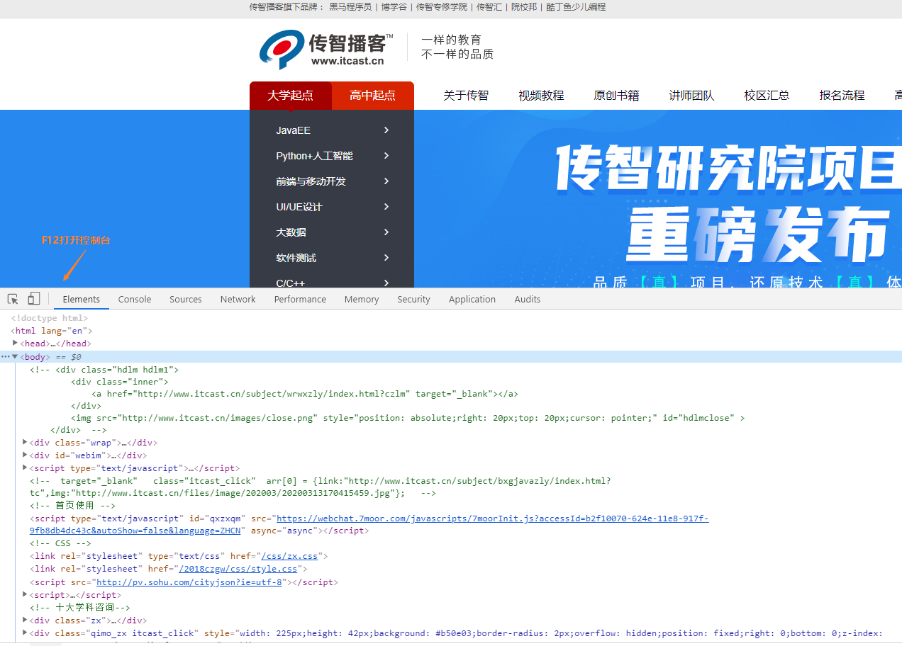
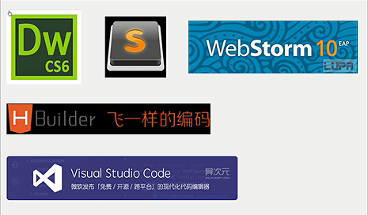
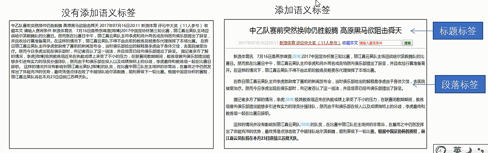

# HTML第一天

学习目标：

 	1. 说出什么是网页
 	2. 认识常用的浏览器
 	3. 了解Web标准

### 一、网页

#### 1.1 什么是网页

​	网站是指在因特网上根据一定的规则，使用HTML等制作的用于展示特定内容的相关的网页集合。

​	网页是网站中的一页，html格式的文件也就是文件后缀为.html，它是由浏览器来打开的。

​	构成问也内容的每一个单位我们称为元素，通常为文字、图片、音频、视频等组成。

#### 1.2 什么是HTML

​	HTML（Hyper Text Markup Language），指的是超文本标记语言，是用来描述网页的内容的。

​	2层含义：

​		1.它可以加入图片、声音、动画、多媒体等内容（超越了普通文本）

​		2.它还可以从一个文件跳转到另一个文件，与其他的文件建立跳转关系（超链接文本）

#### 1.3 网页的形成

​	开发人员在HTML文件中去编写HTML标签，编写完毕后用浏览器打开HTML文件（此时浏览器会对标签进行解析和渲染），最终展示的就是刚刚编写的HTML文件，也就是网页。可以在浏览器中，按F12键打开控制台进行查看。



### 二、常用浏览器

#### 2.1 浏览器介绍

​	浏览器是网页显示和运行的平台，常用的浏览器有：火狐（Firefox）、谷歌（Chrome）、苹果（Safari）、欧朋（opera）还有IE浏览器，统称为五大浏览器。其中谷歌浏览器是目前用户最多的浏览器，可通过[统计](https://tongji.baidu.com/research/site)查看。

#### 2.2 浏览器内核

​	浏览器内核（渲染引擎）：负责读取网页的内容、整理讯息、计算网页的显示方式及显示的画面，及浏览器的“心脏”。

| 内核           | 浏览器名称   | 备注                                |
| ------------ | ------- | --------------------------------- |
| IE           | Trident | IE、猎豹安全、360急速浏览器、百度浏览器等等          |
| Firefox      | Gecko   | 火狐浏览器内核                           |
| Safari       | Webkit  | 苹果浏览器内核                           |
| Chrome、Opera | Blink   | Chrome/Opera浏览器内核，Blink是Webkit的分支 |

### 三、Web标准

> Web标准是由W3C（万维网联盟）组织和其他标准化组织制定的一系列标准的集合。W3C是国际著名的标准化组织。

#### 3.1 为什么需要Web标准

​	早期的浏览器并没有统一的标准，导致各个厂商以自我为中心，每个浏览器解析和展示出来的内容效果都不一样，这就需要开发者去针对每一个浏览器去编写不同的代码。遵循web标准具有以下几个优点：

 	1. 让web的发展前景更广阔
 	2. 内容能被更广泛的设备去访问
 	3. 更容易被搜索引擎搜索
 	4. 降低网站流量费用
 	5. 使网站更易于维护
 	6. 提高页面的浏览速度

#### 3.2 Web标准的构成

主要包括：结构（Structure）、表现（Presentation）和行为（Behavior）三个方面。

| 标准   | 说明                                    |
| ---- | ------------------------------------- |
| 结构   | 结构用于对网页元素进行整理和分类，现阶段主要学习的是HTML        |
| 表现   | 表现用于设置网页元素的版式、颜色、大小等外观样式，主要指css       |
| 行为   | 行为是指网页模型的定义及交互的编写，现阶段主要学习的是Javascript |

Web标准提出的最佳体验方案：结构、样式、行为相分离。理解就是HTML、css、javascript都写到独立的文件中。

### 四、HTML语法规范

#### 4.1 基本语法概述

 	1. HTML标签是由尖括号包围的关键词，例如\<html>
 	2. HTML标签通常是成对出现的，例如\<html>和\</html>，我们称为双标签。第一个标签为开始标签，第二个带有斜杠的为结束标签
 	3. 有些特殊的标签必须是单个标签（较少），例如\<br />，我们称为单标签

#### 4.2 标签关系

标签的关系分为两种：包含关系和并列关系

```html
<!--包含关系，也就是父子关系 -->
<head>
  <title></title>
</head>
<!-- 并列关系，也就是兄弟关系 -->
<head></head>
<body></body>
```

### 五、HTML基本标签结构

#### 5.1 第一个HTML网页

​	每个网页都会有一个结构标签（也称为骨架标签），页面的内容也是在这些基本标签上书写的。

| 标签名             | 定义      | 说明                     |
| --------------- | ------- | ---------------------- |
| <html></html>   | HTML标签  | 页面中最大的标签，根标签           |
| <head></head>   | 文档的头部标签 | 注意：必须在head标签中设置title标签 |
| <title></title> | 文档的标题   | 让页面拥有一个属于自己的标题         |
| <body></body>   | 文档的主题   | 包含文档的所有页面              |

```html
<html>
	<head>
		<title>网页的标题</title>
	</head>
	<body>
		键盘敲烂，月薪过万
	</body>
</html>
```

### 六、网页开发工具



步骤：

 	1. 双击打开开发工具VScode
 	2. 新建文件（快捷键：Ctrl+N）
 	3. 保存（快捷键：Ctrl+S），一定要注意保存为.html后缀文件
 	4. Ctrl+加号键或者减号键，可以进行视图的放大和缩小
 	5. 快速生成html骨架标签：输入英文字符下的 ! ，然后按下Tab键

#### 6.1 文档类型声明标签

<!DOCTYPE>文档类型声明，作用是告诉浏览器当前是哪个版本的HTML文件，这里的<!DOCTYPE html>指的是最新的HTML5版本

注意：

 	1. <!DOCTYPE>声明的位置一定要位于文档的最前面，在\<html>标签之前
 	2. <!DOCTYPE>不是一个HTML标签，它只是单纯的文档声明标签

#### 6.2 lang语言种类

lang用来定义当前文档显示的语言：

 	1. en定义为英语
 	2. zh-CN定义语言为中文

#### 6.3 字符集

字符集（character set）是多个字符的集合，能够识别和存储各种文字。

在head标签内，可以通过<meta>标签的charset属性来规定HTML文档应该使用哪种字符编码

```html
<meta charset="UTF-8" />
```

charset常用的值有：GB2312、BIG5、GBK和UTF-8，其中UTF-8被称作“万国码”，基本包含了全世界所有国家语言字符。

约定：UTF-8统一写法，尽量不要写成utf-8、UTF8等写法。

### 七、HTML常用标签

#### 7.1 标签语义

学习标签最重要的是了解每一个标签所代表的含义是什么，也就是知道这个标签是用来干嘛的。根据不同具有不同含义的标签，在不同的位置去使用，能够让文档结构更加清晰。



#### 7.2 标题标签<h1>~<h6>(重要)

为了让网页更具有语义，我们会在页面的标题部分用标题标签把标题内容包裹起来。HTML提供了六种不同等级的标签\<h1>~\<h6>

```html
<h1>一级标题</h1>
<h2>二级标题</h2>
<h3>三级标题</h3>
<h4>四级标题</h4>
<h5>五级标题</h5>
<h6>六级标题</h6>
```

特点：

 	1. 被标题标签包裹的内容会加粗、字号也会变大
 	2. 从一级标签开始，到六级标签，加粗和字号变大的程度会依次递减
 	3. 一个标题独占一行

#### 7.3 段落标签和换行标签（重要）

在网页中，要把文字有条理的显示出来，必不可少的需要进行段落的划分。我们可以通过<p>标签来讲网页的内容分为若干个段落。

```html
<p>段落一</p>
<p>段落二</p>
<p>段落三</p>
```

网页中的文字在浏览器上显示的时候，是从左到右依次排列的，直到碰到页面的左右边，才会另起一行显示。那么，如果我们希望文本在某一个位置就开始换行，可以使用\<br />标签来实现

```html
今天吃<br />了一包辣条
```

注意：

 	1. \<br />是一个单标签
 	2. \<br />标签只是简单的开始新的一行，而段落会在段落之间增加一些距离

#### 7.4 文本格式化标签

我们在处理网页文字的时候，常常会有需求，突出文字在文本中的显示，展示出它的重要性，这时候我们可以把文字设置加粗或者倾斜。

| 语义   | 标签                         | 说明                      |
| ---- | -------------------------- | ----------------------- |
| 加粗   | <strong></strong>或者<b></b> | 标签文本内容加粗，推荐使用<strong>标签 |
| 倾斜   | <em></em>或者<i></i>         | 标签文本内容倾斜，推荐使用<em>标签     |
| 删除线  | <del></del>或者<s></s>       | 标签文本内容加删除线，推荐使用<del>    |
| 下划线  | <ins></ins>或者<u></u>       | 标签文本内容加下划线，推荐使用<ins>    |

#### 7.5 <div>和<span>标签

<div>和<span>标签是没有语义的，就是单纯用来装内容的。div是divison的缩写，表示分割，分区。span意思为跨度，跨距。

```html
<div>
  这是头部
</div>
<span>今日价格</span>
```

特点：

 	1. <div>标签用来布局，一个标签独占一行。（大盒子）
 	2. <span>标签用来布局，一行中可以有多个<span>盒子。（小盒子）

#### 7.6 图像标签和路径

##### 7.6.1 图像标签

HTML中图像标签用于显示一些图片内容

```html

```

它是单词image的缩写，表示图像，其中src是图像标签必须带有的属性，指向的是图像的url路径。属性的意思就是属于该标签的特性。

| 属性     | 属性值    | 说明                 |
| ------ | ------ | ------------------ |
| src    | 图像的路径  | 必要的属性              |
| alt    | 文本文字   | 替换文本，当图像不能正常显示时出现  |
| title  | 文本文字   | 提示文本，鼠标移到图像上可以弹出内容 |
| width  | 数字，像素值 | 设置图像的宽度            |
| height | 数字，像素值 | 设置图像的高度            |
| border | 数字，像素值 | 设置图像边框粗细           |

注意:

 	1. 图像标签可以拥有多个属性，必须写在标签名的后面
 	2. 属性之间不分前后顺序，标签名、属性与属性之间要用空格去隔开
 	3. 属性采用的是 key="value"格式，属性名=”属性值“

##### 7.6.2 路径

 1.  目录文件夹和根目录

     开发者在开发网页时，会将所有的资源文件，也就是用到的文件都放到一个文件夹里面来进行管理。

     目录文件夹：存放我们所有资源文件的文件夹，就称为目录文件夹

     根目录：根目录就是目录文件夹打开的第一层，就称为根目录

	2. 路径

    - 相对路径

    相对路径：以当前 文件为路径参考，目标文件相对的当前文件的路径关系

    | 相对路径        | 符号      | 说明                                 |
    | ----------- | ------- | ---------------------------------- |
    | 同一级路径（当前路径） | （空）或者./ | 例如：\        |
    | 下一级路径       | /       | 例如：\ |
    | 上一级路径       | ../     | 例如：\     |

    - 绝对路径

    绝对路径是指文件在目录下的绝对位置到目标位置的路径，通常是从盘符开始。

    例如：”C:\Users\Admin_LWY\Desktop\HTML\images\logo.png“

#### 7.7 超链接标签

1. 链接的语法格式

   ```html
   <a href="跳转的目标地址" target="目标窗口的弹出方式">标签包含的内容</a>
   ```

   | 属性     | 作用                                       |
   | ------ | ---------------------------------------- |
   | href   | 用于指定连接目标的url地址（必有属性）                     |
   | target | 用于指定链接目标页面的打开方式，\_self为默认值，\_blank为在新标签页中打开 |

2. 链接的分类：

   ```html
   外部链接：<a href="http://www.baidu.com">百度一下</a>
   内部链接：<a herf="index.html">首页</a>
   空连接：<a herf="#">用#号占位的空连接</a>
   下载链接：<a heft="文件路径及文件名称">下载文件</a>
   网页元素链接：在网页中的各种网页元素，例如文本、图像、表格、音频、视频等都可以加超链接
   锚点链接：通过点击链接，快速定位到页面的某一个位置
   	*在链接文本的href属性中，设置属性为“#名字”的形式，例如<a href="#first">第一</a>
   	*找到目标位置标签，里面添加一个id属性，值为href中绑定的名字,例如：<h1 id="first">第一</h1>
   ```

### 八、HTML中的注释和特殊字符

#### 8.1 特殊字符

如果需要在HTML文档中添加一些文字便于阅读和理解但是又不想让它显示在页面中，那么我们可以使用只是标签来完成。简单点说，给自己看的，不是给用户看的。

```html
<!-- 注释内容 -->
```

tip:在开发工具中可以使用 ctrl+/ 快捷键帮我我们快速注释

#### 8.2 特殊字符

