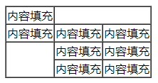

## HTML第二天

### 一、表格标签

#### 1.1 表格标签基本使用

​	table：表格标签
​	tr:表格中的行标签
​	td:表格中的单元格标签

```html
<table>
  <tr> <td></td> <td></td> <td></td> </tr>
  <tr> <td></td> <td></td> <td></td> </tr>
  <tr> <td></td> <td></td> <td></td> </tr>
</table>
```

#### 1.2 表头单元格标签

​	th:表头单元格，会把单元格内容加粗并居中显示

```html
<table>
  <tr> <th></th> <th></th> <th></th> </tr>
  <tr> <td></td> <td></td> <td></td> </tr>
  <tr> <td></td> <td></td> <td></td> </tr>
</table>
```

#### 1.3 表格的属性(了解)

| 属性名称         | 属性值               | 描述              |
| ------------ | ----------------- | --------------- |
| align        | left、right、center | 用来控制表格在页面中显示的位置 |
| cellpadding  | 数值                | 单元格与内部文字的距离     |
| cellspacing  | 数值                | 控制单元格之间的距离      |
| border       | 数值                | 用来控制边框的大小       |
| height/width | 数值                | 用来控制表格的大小       |

#### 1.4小说排行案例

```html
<table>
  <tr> <th>排名</th> <th>关键词</th> <th>趋势</th> <th>今日搜索</th> <th>最近七日</th> <th>相关链接</th> </tr>
  <tr> <td>1</td> <td>鬼吹灯</td> <td></td> <td>345</td> <td>123</td> <td><a href="#">贴吧</a> <a href="#">图片</a> <a href="#">百科</a> </td> </tr>
    <tr> <td>1</td> <td>鬼吹灯</td> <td></td> <td>345</td> <td>123</td> <td><a href="#">贴吧</a> <a href="#">图片</a> <a href="#">百科</a> </td> </tr>
    <tr> <td>1</td> <td>鬼吹灯</td> <td></td> <td>345</td> <td>123</td> <td><a href="#">贴吧</a> <a href="#">图片</a> <a href="#">百科</a> </td> </tr>
    <tr> <td>1</td> <td>鬼吹灯</td> <td></td> <td>345</td> <td>123</td> <td><a href="#">贴吧</a> <a href="#">图片</a> <a href="#">百科</a> </td> </tr>
    <tr> <td>1</td> <td>鬼吹灯</td> <td></td> <td>345</td> <td>123</td> <td><a href="#">贴吧</a> <a href="#">图片</a> <a href="#">百科</a> </td> </tr>
</table>
```

#### 1.5 表格结构标签

​	在开发中表格可能会很长，为了能够让表格更具有语义，可以使用表格的结构标签

​	thead: 表格的表头标签

​	tbody：表格的主体部分

```html
<table>
  <thead>
  	<tr> <th></th> <th></th> <th></th> </tr>
  </thead>
  <tbody>
  	<tr> <td></td> <td></td> <td></td> </tr>
  	<tr> <td></td> <td></td> <td></td> </tr>
  </tbody>
</table>
```

#### 1.6 合并单元格

​	合并单元格的方式：

  -  跨行合并：rowspan

  -  跨列合并：colspan

     ​

       合并单元格的三个步骤：

      1. 先确定是跨行合并还是跨列合并
      2. 确定目标单元格，为其添加属性（按照先行后列的读取顺序，先碰到谁就是目标单元格）
      3. 删除多余的标签



```html
        <table border="1" cellspacing="0">
            <tr>
                <td>内容填充</td>
                <td colspan="2"></td>
            </tr>
            <tr>
                <td>内容填充</td>
                <td>内容填充</td>
                <td>内容填充</td>
            </tr>
            <tr>
                <td rowspan="2"></td>
                <td>内容填充</td>
                <td>内容填充</td>
            </tr>
            <tr>
                <td>内容填充</td>
                <td>内容填充</td>
            </tr>
        </table>
```

### 二、列表标签

​	当遇到有规律的布局时，优先使用列表标签，它是一个容器

#### 2.1 无序列表

​	标签：

​		ul：列表的容器

​		li：列表的每一项标签

​	特点：

​		无序列表在列表项的前面会默认加上小圆点（可以使用css样式去掉）

```html
        <h2>老八喜欢什么？</h2>
        <ul>
            <li>唱</li>
            <li>跳</li>
            <li>rap</li>
            <li>篮球</li>
            <li>老八秘制小汉堡</li>
        </ul>
```

#### 2.2 有序列表

​	标签：

​		ol：列表的容器

​		li：列表的每一项标签

​	特点：

​		有序列表会在列表的每一项前面自动加上序号（可以使用css样式去掉）

```html
		<h2>家庭排行</h2>
        <ol>
            <li>我</li>
            <li>二哈</li>
            <li>我姐</li>
            <li>老爸</li>
            <li>老妈</li>
        </ol>
```

#### 2.3 自定义列表

​	标签：

​		**dl:自定义列表的容器标签**

​			**dt: 自定义列表的标题标签**

​			**dd: 自定义列表的每一项标签**

​	特点：对比有序和无序列表，多出来一个dt标题标签

```html
            <dl>
                <dt>王者农药最强阵容</dt>
                <dd>后羿</dd>
                <dd>大桥</dd>
                <dd>亚瑟</dd>
                <dd>大桥</dd>
                <dd>鲁班</dd>
            </dl>
```

#### 2.4 列表的总结

​	有序列表ol：拼音 you 

​	无序列表ul：拼音 wu

​	自定义列表dl：自定义 ding

### 三、表单使用场景及分类

​	表单的作用，就是用来收集用户数据的

#### 3.1 表单域 

​	标签：

​		**form：表单域标签**

​	作用：用来包裹表单元素的标签

​	属性：

​		**action：提交的地址**

​		**method：提交的方式、方法**

​		**name：给表单元素命名**

```html
<form action="地址" method="GET" name="名称"></form>
```

#### 3.2 input标签

​	标签：

​		**input：表单标签，可以指定不同的type类型**

​	属性：

​		**type：用来设置input的类型**

​			text：文本类型

​			password：密码，文本不可见

​			radio：单选按钮，只能有一个被选中

​			checkbox：复选框 ，可以有多个被选中

​			submit：提交按钮，点击后提交表单

​			reset：重置按钮，点击后重置表单的内容

​			file：上传文件时使用	

​		**name：用来给标签元素命名，如果表单元素没有添加name，那么将不会提交。**

​				**注意：adio和checkbox需要设置相同的name**

​		**value：用来存放表单元素的值**

​		**checked：主要用来设置radio和checkbox的默认勾选**

​		**maxlength：主要用来设置input文本输入元素的最大输入数量**

```html
        <form>
            普通文本输入：<input type="text">
          	<br>
            密码输入：<input type="password">
         	<br>
            单选按钮: 
            <br>
            性别：男<input type="radio" > 女<input type="radio">
            <br>
            复选框:
            <br> 
            爱好：游泳<input type="checkbox"> 健身<input type="checkbox"> 跑步<input type="checkbox">
          	<br>
          	<input type="submit" value="提交"><input type="reset" value="重置">
        </form>
```

### 四、label标签

​	标签：

​		**label：标签，用于扩大表单元素的选中范围**

​	属性：

​		**for： 用于目标表单元素，值为#加上表单元素的id值**

```html
<label for="#username">用户名：</label>
<input type="text" id="username">
```

### 五、select下拉菜单

​	标签：

​		**select：下拉菜单**

​			**option：下拉菜单的每一项**

​	属性：

​		**selected：用来设置默认被选中的项，添加给option标签**

```html
<h2>最喜欢的女明星</h2>
<select>
  <option>迪丽热巴</option>
  <option>马尔扎哈</option>
  <option>古力娜扎</option>
</select>
```

### 六、文本域标签

​	标签：

​		**textarea：文本域标签，表示可以输入大量的文字**

​	属性：

​		**cols：表示列的数量**（不重要）

​		**rows：表示行的数量**（不重要）

```html
    <form action="">
        评论的内容：
        <textarea cols="20" rows="15">二营长，把你的意大利炮拉上来</textarea>
    </form>
```

